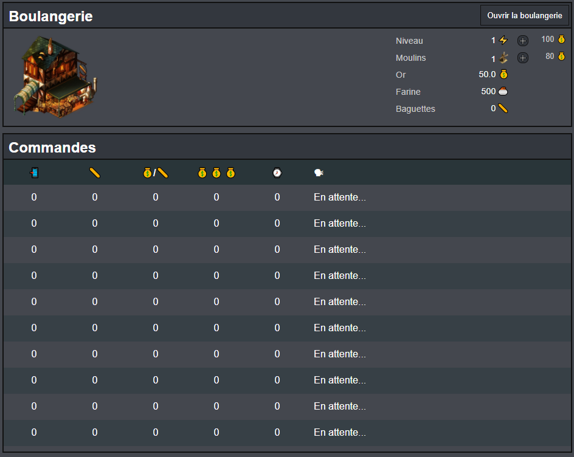
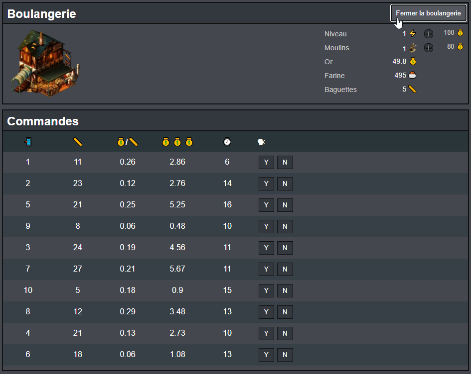
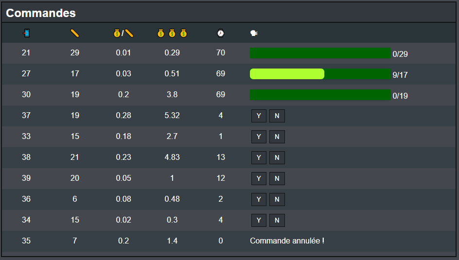
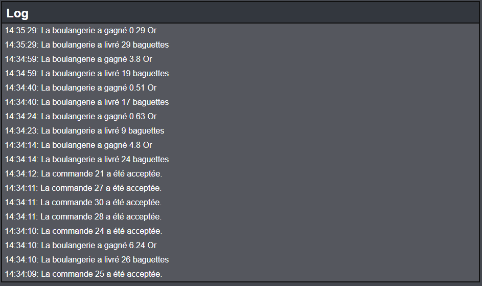
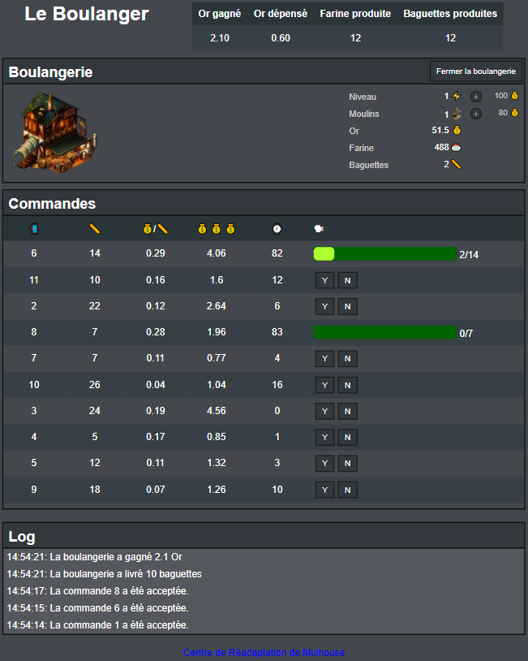

# La boulangerie

Gestion de ressources en temps réel avec VueJS.

# Objectifs

L'objectif de cet exercice est de créer une simulation de production et de gérer des commandes entrantes associées à cette production.

# Contexte

## La boulangerie

Le boulanger est LE spécialiste des baguettes.

Pour fabriquer ses baguettes, le boulanger a besoin de farine. 

Pour produire sa farine, le boulanger doit acheter des moulins.

Pour acheter des moulins, le boulanger a besoin d'or.

Lorsque la boulangerie est ouverte, le boulanger crée des baguettes à la chaine.

Pour augmenter la cadence de production, le boulanger doit améliorer sa boulangerie.

Pour améliorer sa boulangerie, le boulanger a besoin d'or.

La boulangerie gènère des faibles coûts de maintenance (en or) indexés sur son niveau.

Pour gagner de l'or, le boulanger vend ses baguettes.

Augmenter le niveau de la boulangerie augmente également sa popularité. 
La qualité des baguettes s'améliore et leur prix augmente en conséquence. 

---

## Les commandes 

Le boulanger vend ses baguettes à la commande.

Le boulanger gère ses commandes dans une file d'attente.

La file d'attente peut contenir au maximum 10 commandes.

Pour chaque commande :
- un nombre de baguettes est défini
- le prix unitaire de la baguette est fixé par le demandeur
- un temps limite est défini
    - la commande doit être livrée avant l'expiration du délai
- le nombre de baguettes et le prix unitaire permettent de calculer le montant total de la commande

Le boulanger peut accepter ou refuser une commande.

Une commande acceptée ne peut plus être annulée.

Les commandes sont traitées dans l'ordre dans lequel elles ont été acceptées.

Une commande est livrée lorsque la boulangerie dispose de suffisemment de baguettes pour satisfaire la commande.

Lorsqu'une commande est livrée, le boulanger gagne le montant total de la commande en or.

--- 

## Formules (prix, production, commandes...) 
Soit :
- BAKERY_LEVEL = niveau de la boulangerie
- NB_MILLS = nombre de moulins possédés

### Boulangerie
- Coût de maintenance par seconde (en or): 0.05 * BAKERY_LEVEL * NB_MILLS
- Prix d'amélioration de base (en or): 100
- Chaque amélioration augmente le prix de la suivante selon cette formule:
    - (nouveauPrix = prixActuel * 1.5)

#### Notoriété et commandes

Le nombre de baguettes pour chaque commande est indexé sur le niveau de la boulangerie.
Il est déterminé au hasard à la création de la commande et calculé selon ces règles:
- minimum: 5
- maximum: 30 * BAKERY_LEVEL

Le prix unitaire est également indexé sur le niveau de la boulangerie.
Il est déterminé au hasard à la création de la commande et calculé selon les règles suivantes: 
- minimum: BAKERY_LEVEL / 100
- maximum: 30 * BAKERY_LEVEL / 100

### Moulins
- Prix d'achat de base (en or): 80
- Chaque moulin acheté augmente le prix du suivant selon cette formule:
    - (nouveauPrix = prixActuel * 1.5)

### Farine
- Production par seconde: NB_MILLS
    - ex: une boulangerie possédant 5 moulins produit 5 unités de farine par seconde
- Consommation par seconde: LEVEL + 1
    - ex: une boulangerie de niveau 3 consomme 4 unités de farine par seconde

### Baguettes
- Production par seconde : BAKERY_LEVEL
    - ex: une boulangerie de niveau 3 fabrique 3 baguettes par seconde

# Interface

## La boulangerie 

Créer une page web et représentez les données de la boulangerie à l'identique de la capture suivante (la largeur du cadre s'adapte à la largeur de la fenêtre).

Les images se trouvent dans le répertoire assets. Certaines icônes (l'éclair, le sac d'or, la baguette...) ne sont pas des images mais des caractères UTF-8. A vous de trouver la manière de les afficher :) Recherchez sur ce site : https://www.utf8icons.com/.

Le bouton "ouvrir la boulangerie" permet de démarrer la production.
Lorsque la boulangerie est ouverte, une fonction s'exécute toutes les secondes et les règles définies plus haut s'appliquent (perte d'or, production de farine...).

Ajouter un entête de page avec un titre et un tableau affichant le cumul des gains et pertes de ressources.

## Les commandes

Sous la boulangerie, ajouter un bloc contant un tableau de 10 lignes (+ entête du tableau).

Chaque ligne de ce tableau correspond à un emplacement pouvant accueillir une commande. Pour chaque commande, le tableau indique :
- Le numéro de commande
- Le nombre de baguettes demandées pour cette commande
- Le prix unitaire de la baguette pour cette commande
- Le prix total de la commande (prix unitaire * nombre baguettes)
- Le temps restant
    - nouvelle commande : aléatoire entre 10 et 60 secondes
    - commane acceptée : le compteur redémarre à 90 secondes
- une colonne d'action dynamique
    - nouvelle commande : 
        - 1 bouton pour accepter la commande
        - 1 bouton pour refuser la commande
    - commande acceptée :
        - une barre indiquant la progression de la commande
    - commande annulée :
        - texte "Commande annulée"
    - pas de commande à cet emplacement
        - text "En attente..."

Commandes en attente d'être acceptées/refusées :

Commandes en cours : 

Comme pour la boulangerie, les informations du tableau sont actualisées une fois par seconde.

Lorsque la boulangerie est fermée, le tableau des commandes est réinitialisé.

## Le journal 

Sous le bloc des commandes, ajouter un noubeau bloc qui affichera les 20 derniers évènements : 

- La boulangerie gagne de l'or
- La boulangerie accepte une commande
- La boulangerie livre une commande

# Aperçu de l'interface complète :

---

> Validez le fonctionnement de votre application avec votre formateur.

---

Lorsque vous avez terminé, proposez un système de sauvegarde de l'état actuel de la partie dans le navigateur avec l'api LocalStorage. 

- Lors d'une sauvegarde, la partie est mise en pause.
- Au chargement, si une sauvegarde existe, l'état de la partie est rétabli.
- Si l'utilisateur quitte la page (en fermant le navigateur, par exemple), la partie est sauvegardée.